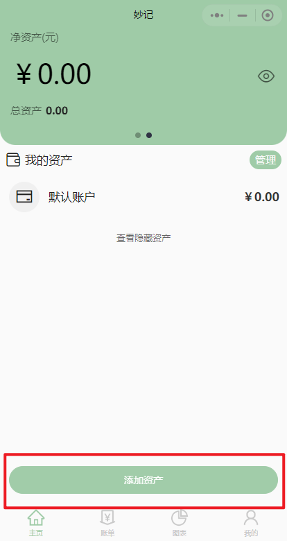

# 资产
## 用处
可以将自己的资金做一个统计，如银行卡、微信钱包等，在记账的时候必须选择资产账户，该账户会自动减少或者增加金额计算。
> 如果没有资产，会自动新增一个默认资产供记账使用。
## 新增资产
1. 左滑主页上方金额统计卡片，进入资产页

|  |  |
| :----------------------- | :-------------------------- |

2. 点击下方添加资产按钮，进入添加资产界面

|  |  |
| :----------------------- | :-------------------------- |

3. 选择一个资产类型进行添加，这里我选择微信钱包
4. 进入资产配置页面，可以在此页面填入资产余额，资产名（橙色框），以及资产配置（红色框）  

5. 点击保存即可保存资产，在主页资产中可以查看自己的资产

## 使用资产
- 在记一笔界面中，点击左下方资产标签可以选择使用的资产

|  |  |
| :----------------------- | :-------------------------- |

## 资产管理
### 修改资产
1. 在资产界面中，左滑某一资产栏，点击修改按钮进入资产配置页面

2. 在资产配置界面，可以修改资产金额，资产名，以及设置是否在首页隐藏资产和是否计入总资产中

|  |  |
| :----------------------- | :-------------------------- |

> 例如我修改微信余额为*568*元，资产名为*我的微信大号钱包*，并设置为隐藏资产。点击保存后，在首页资产界面中则不会直接显示，需要点击查看隐藏资产按钮弹出隐藏资产。同时，隐藏资产不会被计入总资产

|  |  |
| :----------------------- | :-------------------------- |

::: details 另一种修改方式
点击管理按钮进入我的资产页面，此页面中也可以对资产进行修改
:::

### 设置默认资产
1. 点击资产界面右侧管理按钮，进入我的资产页面
2. 点击默认资产栏，弹出资产选择框，这里我选择微信钱包作为默认资产
3. 修改成功后即可看到默认资产变为了微信钱包

|  |  |
| :----------------------- | :-------------------------- |
|  |  |
