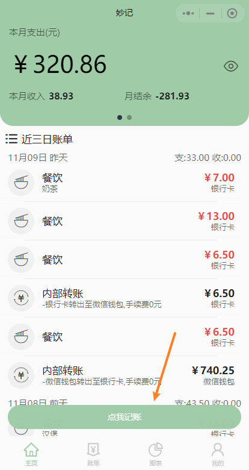
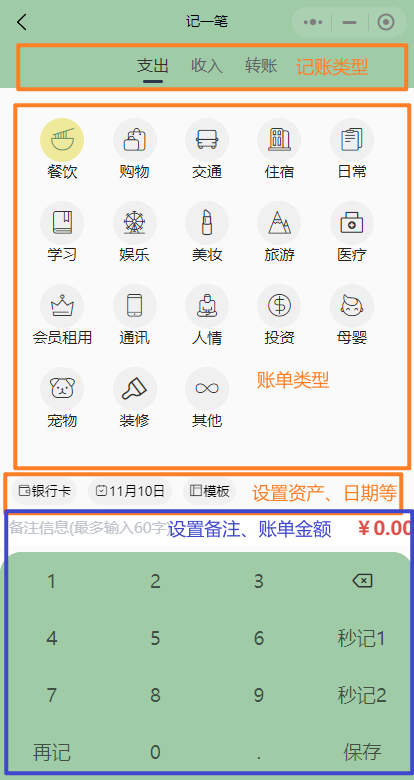
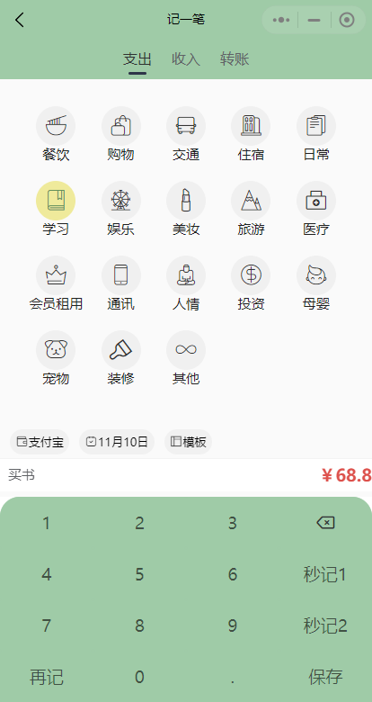
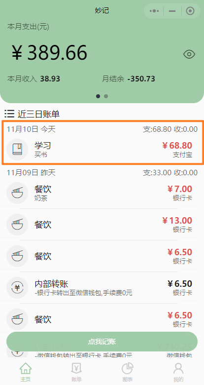
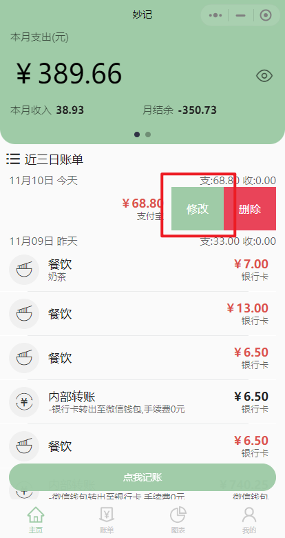
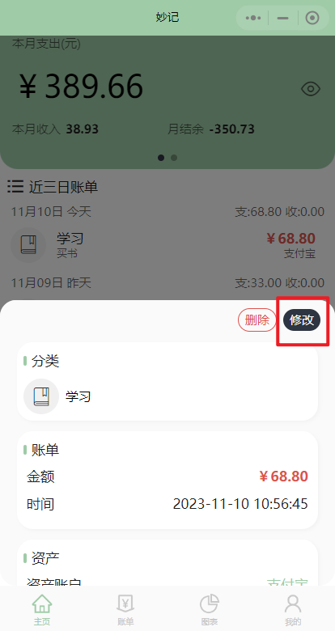
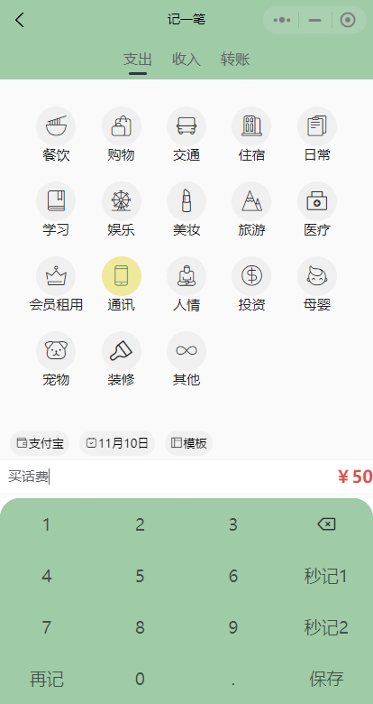
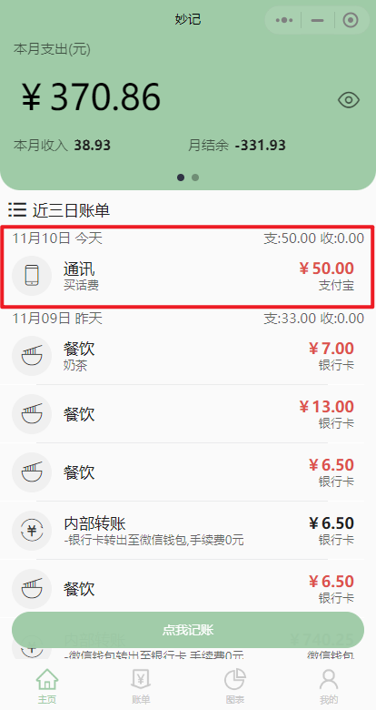
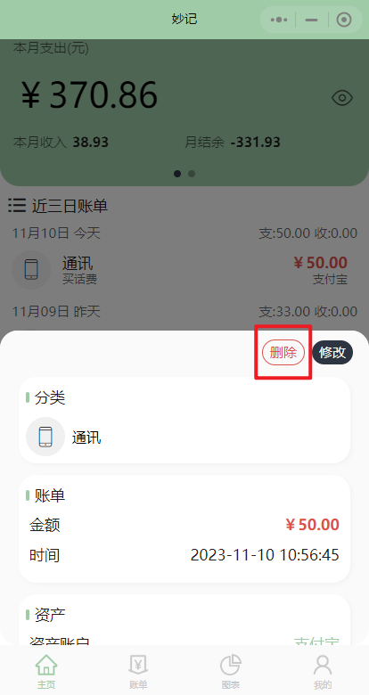

# 账单
## 说明
账单记录用户的记账数据，包含金额，类型，使用资产，记账事件，备注等信息。
## 新增一个账单
1. 点击首页下方的"点我记账"按钮，进入记一笔页面  
  
2. 在记一笔页面中，可以选择记账类型（支出、收入、还是转账），账单类型（餐饮、购物等），使用资产，记账日期等功能  
  
3. 这里我选择支出、学习分类、支付宝支付、日期默认为今天、备注买书、并输入金额68.8。点击保存后即可新增一个账单

|  |  |
| :----------------------- | :-------------------------- |

## 修改账单
1. 在账单列表中，左滑想要修改的账单或点击想要修改的账单，会显示修改按钮，点击即可进入修改账单页

|  |  |  |
| :----------------------- | :-------------------------- |:-------------------------- |

2. 修改你想要修改的内容，点击保存即可修改账单，**对应资产的余额也会自动进行更新**。这里我修改账单类型为通讯，金额改为50，点击保存

|  |  |
| :----------------------- | :-------------------------- |
## 删除账单
在账单列表中，左滑想要删除的账单或点击想要删除的账单，会显示删除按钮，点击删除即可删除账单，**对应资产的余额也会自动进行更新**

