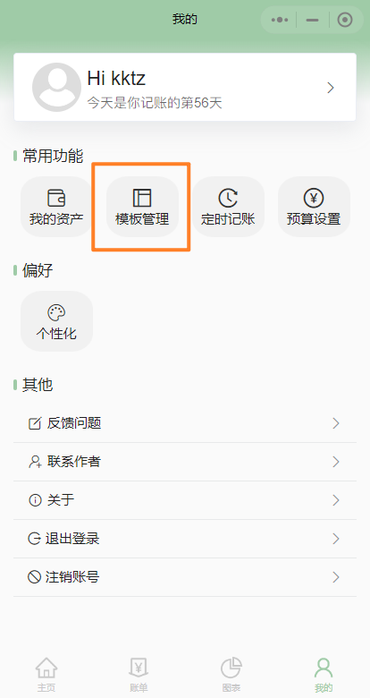
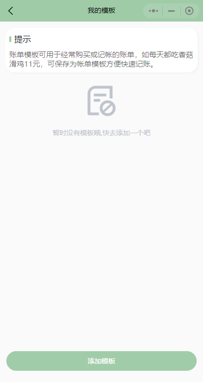
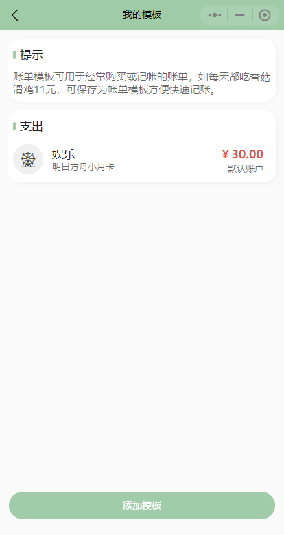
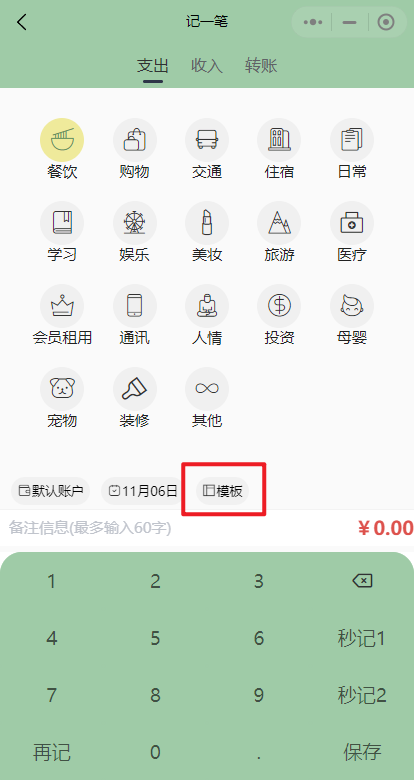
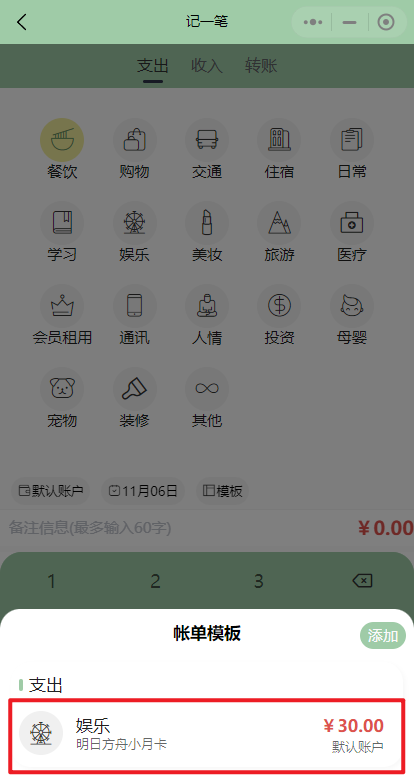
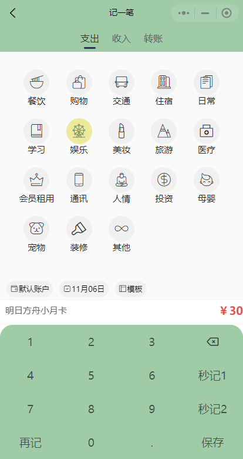
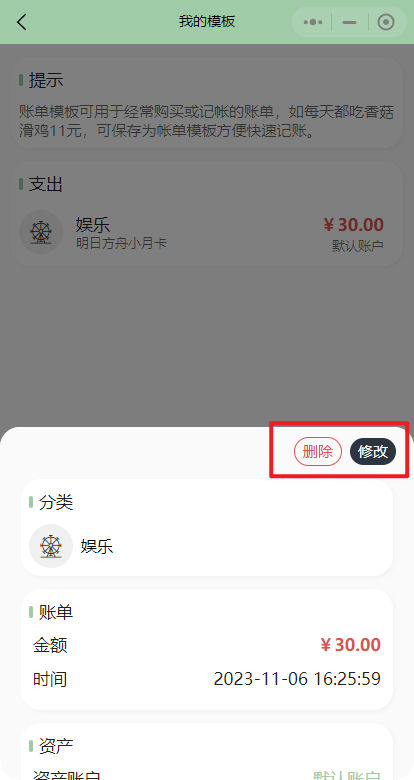

# 模板
## 用处
模板可用于记录经常购买的账单，方便快速记账。如每天都买水花2元，则可以记为模板，在记一笔页面可直接调出使用。
## 设置模板
1. 点击界面下方"我的"栏，进入用户界面
2. 点击模板管理按钮，进入模板管理页  

|  |  |
| :----------------------- | :-------------------------- |

3. 点击下方**添加模板**按钮，进入记一笔页面
4. 在记一笔页面中，设置你想记录的模板，这里以创建 *明日方舟月卡* 模板为例  

5. 点击保存后创建模板成功，返回到了模板页，可以看见已经创建好的模板  

> 另一种方式：在记一笔页面的模板列表中，点击右上角添加也可以设置模板
## 使用模板
- 在记一笔页面中点击"模板"标签，会弹出模板列表，点击一个模板即可使用

|  |  |
| :----------------------- | :-------------------------- |
|  ||

## 修改、删除模板
1. 进入模板管理页面
2. 点击某一个你想修改或删除的模板，弹出模板详情框，在右上角有可对模板进行操作的按钮

    - 点击删除模板即可删除该模板
    - 点击修改会进入到记一笔页面，修改完成后点击保存即可保存新模板

