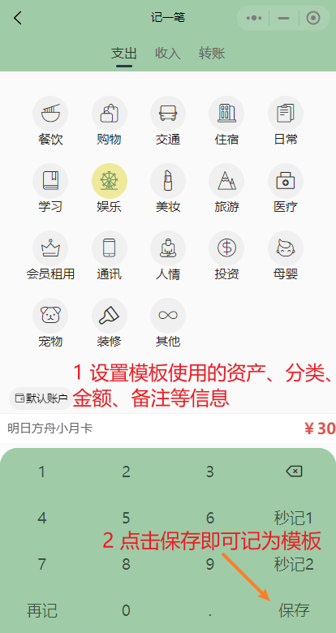

# 模板
## 用处
模板可用于记录经常购买的账单，方便快速记账。如每天都买水花2元，则可以记为模板，在记一笔页面可直接调出使用。
## 设置模板
1. 点击界面下方"我的"栏，进入用户界面
2. 点击模板管理按钮，进入模板管理页  

|  |  |
| :----------------------- | :-------------------------- |

3. 点击下方**添加模板**按钮，进入记一笔页面
4. 在记一笔页面中，设置你想记录的模板，这里以创建 *明日方舟月卡* 模板为例  

5. 点击保存后创建模板成功，返回到了模板页，可以看见已经创建好的模板  

6. 在记一笔页面中点击"模板"标签，会弹出模板列表，点击一个模板即可使用

|  |  |
| :----------------------- | :-------------------------- |
|  ||